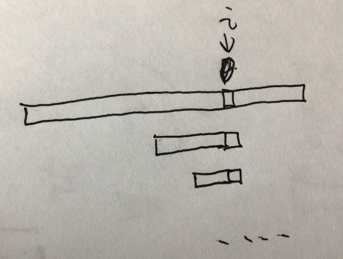

# 4.1

- 作字符串S=A+B+a，其中a是字符串A,B中都未出现过的字符。
- 对字符串S作findNext的操作。
- 令slen=S.length(),maxlen=min(A.length(),B.length());
- 返回值ans=min(maxlen,next[slen-1]); 因为返回值最大的可能性为maxlen。


算法复杂度 O(n+m)，n,m 分别为A,B的长度。


# 4.2

非优化版本

```cpp
int* findNext(string P) {
    int j, k;
    int m = P.length();     // m为模式P的长度
    assert( m > 0);         // 若m=0,退出
    int *next = new int[m];     // 动态存储区开辟整数数组
    assert( next != 0);         // 若开辟存储区域失败,退出
    next[0] = -1;              // next[0]的定义就为-1
    j=0; k=-1;   //初始化临时变量
    while (j < m-1) {  //计算next[1:m-1],所以j+1<m
        while (k >= 0 && P[k] != P[j])  // 不等则采用 KMP 自找首尾子串
            k = next[k];        // k 递归地向前找
        j++; k++;  //j++之后才是这轮所求next数组的下标
        next[j] = k;// case 1 k=-1 找到了next数组头部,那么next[j]为0 
        			// case 2 P[k]==P[j] 找完之后所得k再加1就是next[j]的值
    }
    return next;
}

```

优化版本

```cpp
int* findNext(string P) {
    int j, k;
    int m = P.length();     // m为模式P的长度
    assert( m > 0);         // 若m=0,退出
    int *next = new int[m];     // 动态存储区开辟整数数组
    assert( next != 0);         // 若开辟存储区域失败,退出
    next[0] = -1;              // next[0]的定义就为-1
    j=0; k=-1;   //初始化临时变量
    while (j < m-1) {  //计算next[1:m-1],所以j+1<m
        while (k >= 0 && P[k] != P[j])  // 不等则采用 KMP 自找首尾子串
            k = next[k];        // k 递归地向前找
        j++; k++;  //j++之后才是这轮所求next数组的下标
        if(P[k]!=P[j])
        	next[j] = k;// case 1 k=-1 找到了next数组头部,那么next[j]为0 
        			// case 2 P[k]==P[j] 找完之后所得k再加1就是next[j]的值
        else next[j]=next[k];
        // 这里是优化版本和非优化版本唯一不同的地方，意义是如果P[k]==P[j]，那么如果P[j]已经不匹配了，P[k]在此处也不匹配,所以只有P[k]!=P[j]下一次匹配才有可能成功。
        //next[j]=next[k]表示 P[k]!=P[next[k]]并且是递归下去最大满足要求的,所以P[j]!=P[next[k]],所以next[j]=next[k]
    }
    return next;
}
```

关于递归下去求next正确性的证明：




i是此轮待求的next数组下标

我们来证明为什么待求的k都是在k=next[k]这个递归当中。

反证法：

假如说我们待求的 k’>next[ki]&&k'<ki 那么根据next数组的定义 next[ki]>=k',推论和条件形成了矛盾。所以原命题正确。