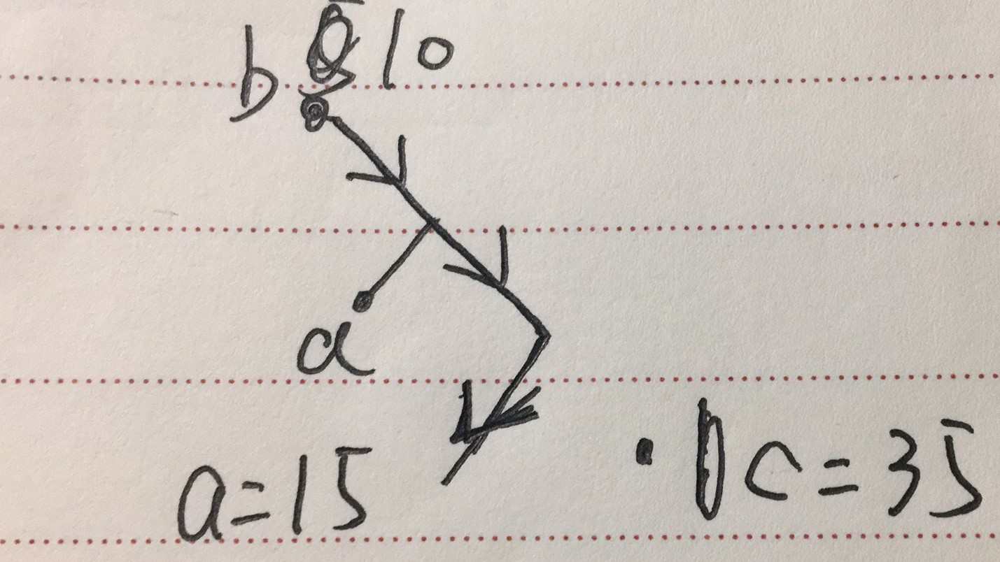

# 5.1

## 1

设有k个非叶子节点

该二叉树的总边数$2k$ 看出度 或者$n+k-1$ 看入度

则$2k=n+k-1$,

得$k=n-1$

所以共有$2n-1$节点

## 2

用数学归纳法

假设最大层次为$k$的时候该结论成立。

讨论$k+1$的时候结论是否成立

由题意可知，必存在$2s$个深度为$k+1$的叶子结点，他们构成的集合为Q，他们两两组合$\sum_{Q}2^{-l_i} = \sum_{Q'}2^{-l_i}$ Q'为s个深度为k的叶子结点。

由推论假设最大层次为k的时候结论成立，所以k+1的时候结论也成立。

综上所述，结论成立。


# 5.2

并不成立。




如图箭头是该路径 a属于S1 b属于S2 c属于S3。$a,b,c$按图中取值。 a=15 b=10 c=35

所以命题并不成立。

# 5.3

```cpp
//先计算该二叉树的深度
int getDepth(treenode *cur){
    if(!cur) return 0;
    return max(getDepth(cur->left),getDepth(cur->right))+1;
}
// 检查该二叉树是否为完全二叉树
bool check(treenode *cur,int curdepth,const int &depth, bool &flag){
    // depth 用于存储二叉树的深度 类型为const int& flag用于记录是否已经记录到最后一个叶子结点
    if(curdepth<h-1){ //不是最后两层
        if(!cur->left)
            return false;
        if(!cur->right)
            return false;
        return check(cur->left,curdepth+1,depth,flag) && check(cur->right,curdepth+1,depth,flag);
    }
    else{       //是倒数第二层
        if(!flag){ //未记录到最后一个叶子节点
            if(cur->left&&cur->right)
                return true;
            else if(cur->left&&!cur->right){
                flag=true;
                return true;
            }
            else if(!cur->left&&cur->right)
                return false;
            else {
                flag=true;
                return true;
            }
        }
        else{ //记录到最后一个叶子节点
            if(cur->left||cur->right)
                return false;
            return true;
        }
    }
}

bool func(treenode *root){
	int h = getDepth(root);
    bool f =false;
    return check(root,1,h,f);
}
```

时间复杂度分析:

n为二叉树的节点个数

getDepth 函数 时间复杂度为O(n)

check的最坏时间复杂度为O(n)

总的时间复杂度O(n)