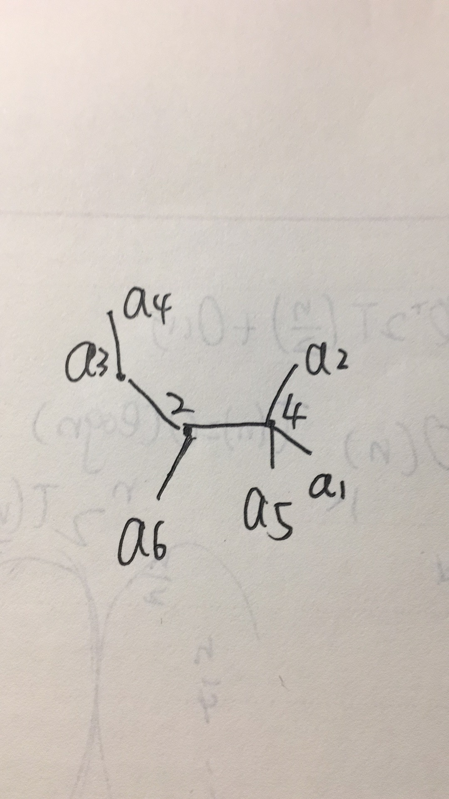

# 6.1



由六元序列可知，最后的二元树的两个节点分别为2，4。 由序列的最后三项$2 ，2， 4$ 可以得到$a_3,a_2,a_1并且a_3<a_2<a_1$ 。

序列第三项$1$ 可知，$a_3,a_2,a_1$ 其中有一个1。那么$a_3=1$ 。

由序列前两项$2,4$ 可以完成此图。

$a_6<a_5<a_4<a_2<a_1$ 得到$a_1-a_6$ ,分别为$8,7,1,6,5,3$。

唯一性：

上述步骤均有唯一性，所以恢复结果也有唯一性。


# 6.2

 ## 1

贪心算法。


- 对于每个节点$p$ ,计算以它为根节点的最长带权路径。 
- depth(p)=max(depth(p->sons[i])+values[i]);
- 如果depth(p)>d，则将节点$p$ 放入s，同时它向上返回最长带权路径的时候返回0
- 从根节点开始递归的求最长带权路径，同时在求的时候把需要删去的节点放入S。


# 2

cpp代码

```cpp
int work(treenode *p){
    int len = p->sons.size();
    int h=0;
    for(int i=0;i<len;++i)
        h=max(h,work(p->sons[i])+values[i]);
    if(h>d){
        S.insert(p);
        h=0;
    }
    return h;
}
```

时间复杂度：

令T的节点个数为n

work遍历所有节点

时间复杂度O(n)


正确性证明：

对于两课带权树$T_1,T_2$,如果$T_1 \subseteq T_2$ ,易得 题目所求的最小顶点集$S_1,S_2,  num(S_1)\leq num(S_2) $

考虑算法第k步，由贪心算法的步骤可以知道：

对于算法前k-1步得到的剩余待切割带权树$T_{k-1}$,算法第k步得到的剩余待切割带权树$T_k$ 是其中可行的最小集。

同时算法第1步得到的剩余待切割带权树$T_1$ 是$T$ 一次切割后的最小集。

所以对于任意不同于算法的切割方法，必定在第$j$步，得到一个$T_{j}^{'}，T_j \subseteq T_j^{'}$，所以这种切割方法不会比算法所得到的好。


# 3

$S={D}$